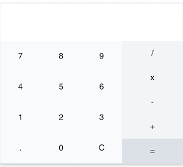

# Calculator [](https://travis-ci.org/melkir/calculator) [](https://codecov.io/gh/melkir/calculator)

# [](http://melkir.github.io/calculator)

> Simple calculator with React and Redux

## Generating and serving the calculator project

```
$ git clone https://github.com/melkir/calculator.git
$ cd calculator
$ npm install
$ npm start
```

Navigate to `http://localhost:3000/`. The app will automatically reload if you change any of the source files.
